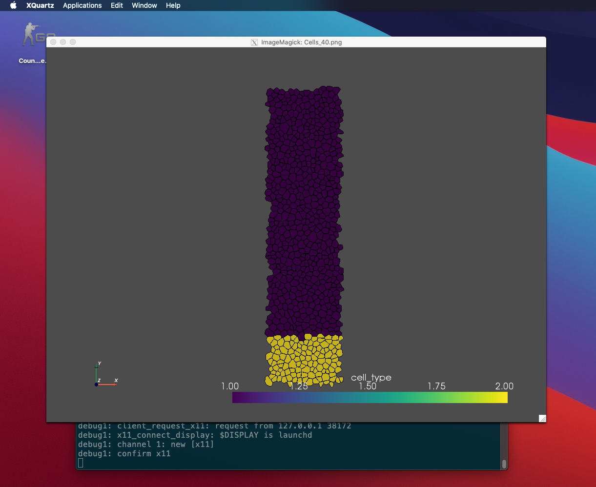

# Login Euler with X11 forwarding

## Install xQuartz

If homebrew installed:

```bash
brew cask install xquartz
```

Or install from [XQuartz website](https://www.xquartz.org/)

**Restart the machine**

## Enable iglx

Euler X11: https://scicomp.ethz.ch/wiki/Accessing_the_clusters#Mac_OS_X
Euler X11 macOS troubleshooting: https://scicomp.ethz.ch/wiki/Getting_started_with_clusters#Troubleshooting
Link: https://www.visitusers.org/index.php?title=Re-enabling_INdirect_glx_on_your_X_server

```bash
defaults write org.macosforge.xquartz.X11 enable_iglx -bool true
```

According to this discussion [here](https://discussions.apple.com/thread/2048176), but might not be relevant 

```bash
# check before writing
defaults read com.apple.x11 nolisten_tcp
defaults read org.X.x11 nolisten_tcp

defaults write com.apple.x11 nolisten_tcp -boolean false
defaults write org.X.x11 nolisten_tcp -boolean false
```

To validate:
```bash
printenv DISPLAY
# /private/tmp/com.apple.launchd.oyK9GxAmbh/org.macosforge.xquartz:0
```

## SSH config

locate your config file, mine is at `~/.ssh/config`

```bash
Host euler.ethz.ch                                                       
    HostName euler.ethz.ch                                                 
    User USERNAME                                                          
    ForwardX11Trusted yes                                                  
    ForwardX11 yes                                                         
#     XAuthLocation /opt/X11/bin/xauth # not required
```

## Connect & Debug

```bash
ssh -Y USERNAME@euler.ethz.ch

# debug
ssh -v -Y USERNAME@euler.ethz.ch
# check for 
# debug1: Requesting X11 forwarding with authentication spoofing.

# validate
printenv DISPLAY
# localhost:10.0

display random.png
# show up in the XQuartz window
```



## Note

Noted that this might conflict with some plotting software like R, matplotlib in python, 

If so, one can switch to headless mode and view 
